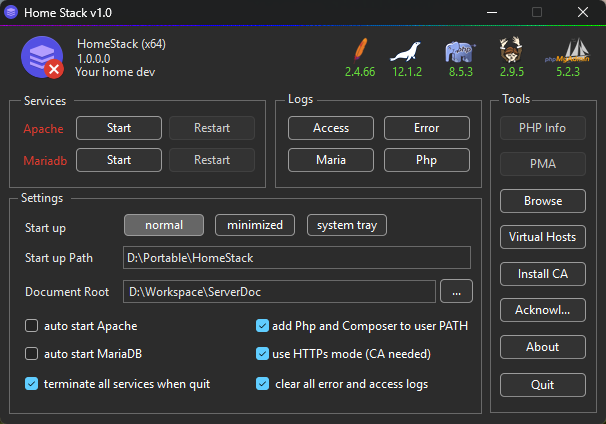

<p align="center">
  
</p>

# 🏠 HomeStack

**HomeStack** is a lightweight, portable management interface for orchestrating local server infrastructure on Windows. It provides a native control plane for the **AMP stack (Apache, MariaDB, PHP)**, pre-integrated with **Composer** and **phpMyAdmin** to deliver a high-performance local development environment.

## 🌟 Key Features

- **Native Windows Control Plane**: A lightweight interface designed for low overhead and maximum stability.
- **Zero-Config AMP Stack**: Pre-configured **Apache**, **MariaDB**, and **PHP** optimized for out-of-the-box compatibility.
- **Portable by Design**: Run your environment from a USB drive or synced cloud folder—no registry changes or complex installers.
- **Built-in Tooling**: Integrated **Composer** for dependency management and **phpMyAdmin** for effortless database administration.
- **SSL Ready**: Simple batch scripts to generate and trust local SSL certificates for HTTPS development.

## ⚙️ Requirements

Before building HomeStack, ensure you have the following tools configured:

- **C/C++ Compiler**: [winlibs-w64ucrt](https://winlibs.com/) is recommended for this biuld.
- **Make**: Use `mingw32-make.exe`.
  - _Tip: Rename `mingw32-make.exe` to `make.exe` in your `../GCCx64/bin` folder for easier command-line usage._
- **Resource Editor**: [ResEdit](https://resedit.apponic.com/) for managing application icons and metadata.
- **Code Editor**: [VS Code](https://code.visualstudio.com) or your preferred IDE.

## 🚀 Quick Start

### 1. Installation

1.  **Download** the latest release from the [Releases](https://github.com/AboSohyle/HomeStack/releases/tag/1.0.0.0) page.
2.  **Extract** the ZIP archive to your preferred directory (e.g., `C:\HomeStack`).
3.  **Run** `HomeStack.exe` to launch the control panel.

### 2. Service Management

- Launch the control plane and click **Start** next to **Apache** and **MariaDB**.
- The status indicators will turn **green** once services are live.

### 3. Root Web Directory Setup

- On the first launch, a dialog will prompt you to select your **Root Web Directory**.
- Place your project folders within this directory.
- Access projects via `http://localhost/your-project-name`.

### 4. Local SSL Certificate Generator

- The script `..\config\create_cert.bat` automates the creation of a Self-Signed Root CA and generates SSL certificates for your local development domains (e.g., localhost).

- After running the script, a folder named after your site will be created:
- File Purpose

| File                    | Purpose                                    |
| :---------------------- | :----------------------------------------- |
| localhost\localhost.crt | The Certificate (Public)                   |
| localhost\localhost.key | The Private Key (Keep this safe)           |
| CA\MyLocalCA.crt        | Your Root CA (Install this in your system) |

### 5. Project Structure and Upgrade

- If you plan for an upgrade `Apache, PHP, Mariadb etc...` keep files structrue as following

```text
HomeStack  [never change root folder name]
   ├── apache/ [never change folder name]
   │    ├── bin/
   │    ├── error/
   │    ├── logs/
   │    └── modules/
   ├── mysql/ [never change folder name]
   │    └── bin/
   │         └── mariadb files go here...
   ├── php/ [never change folder name]
   │    └── php files go here...
   ├── composer/ [never change folder name]
   │    └── composer files go here...
   ├── config/ [never change folder name]
   │    └── config files [PLEASE DO NOT EDIT UNTILL YOU KNOW WHAT YOU ARE DOING!]
   ├── phpMyAdmin/ [never change folder name]
   │    └── phpmyadmin files go here
   ├── logs/ [never change folder name]
   ├── tmp/ [never change folder name]
   └── HomeStack.exe
```

## 🎯 Contributing

Contributions to the HomeStack project are welcome! Please feel free to fork the repository, make your changes, and submit a pull request.
